# AWS VPC Lab

Built a custom VPC on AWS from scratch with public/private subnet segmentation, an internet gateway, route tables, and an EC2 instance accessible via SSM Session Manager — no open inbound ports, no key pair.

---

## Architecture

```
                        INTERNET
                            |
                  [Internet Gateway]
                    tami-cloud-gw
                            |
        ┌───────────────────────────────────┐
        │          tami-cloud VPC            │
        │          10.0.0.0/16               │
        │          us-east-2                 │
        │                                    │
        │  ┌────────────────────────────┐    │
        │  │   public-tami-subnet        │    │
        │  │   10.0.1.0/24  |  us-2a    │    │
        │  │                            │    │
        │  │   [tami-ec2-server]        │    │
        │  │   Amazon Linux 2023        │    │
        │  │   t2.micro                 │    │
        │  │   IAM: ec2-ssm-role        │    │
        │  │                            │    │
        │  │   0.0.0.0/0  →  IGW        │    │
        │  │   10.0.0.0/16 →  local     │    │
        │  └────────────────────────────┘    │
        │                                    │
        │  ┌────────────────────────────┐    │
        │  │   private-tami-subnet       │    │
        │  │   10.0.2.0/24              │    │
        │  │   no internet route        │    │
        │  │   10.0.0.0/16 →  local     │    │
        │  └────────────────────────────┘    │
        │                                    │
        └───────────────────────────────────┘
                            |
                      [SSM Service]
               access via IAM, no port 22
```

---

## What's in this repo

```
VPC-LAB/
├── docs/
│   ├── architecture.md
│   ├── setup-guide.md
│   └── screenshots/
├── scripts/
│   └── verify-setup.sh
└── terraform/
    └── README.md
```

---

## Build walkthrough

**IAM and billing setup first**

Created a non-root IAM admin user, then set a $5 monthly billing budget with alerts at 50% and 85% before touching any compute resources.

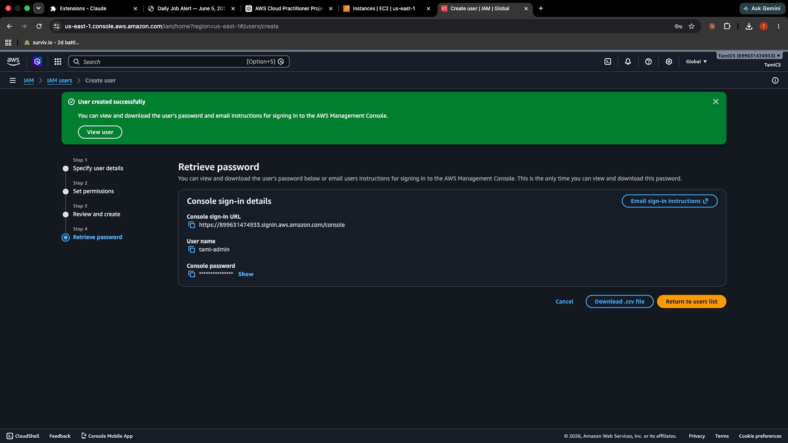
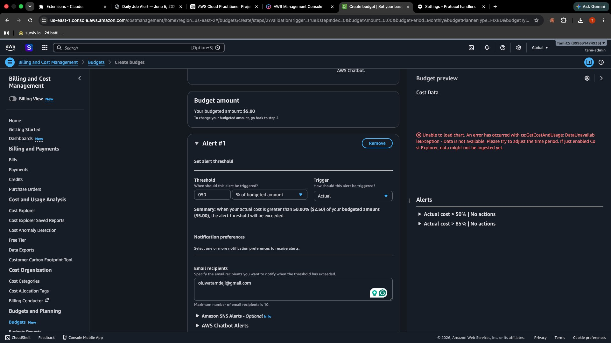

---

**VPC and subnets**

Custom VPC at `10.0.0.0/16`. Public subnet at `10.0.1.0/24` with auto-assign public IP enabled. Private subnet at `10.0.2.0/24` with no public IP assignment.

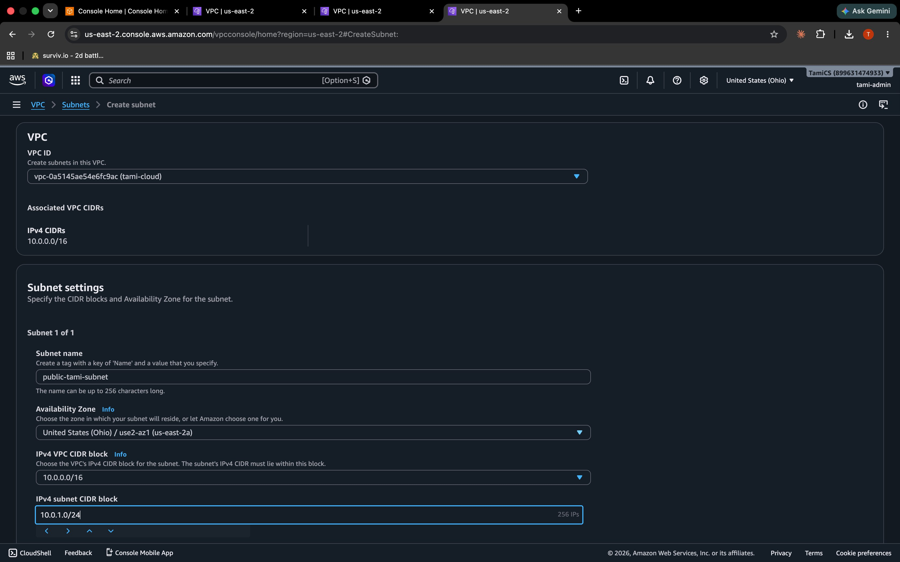
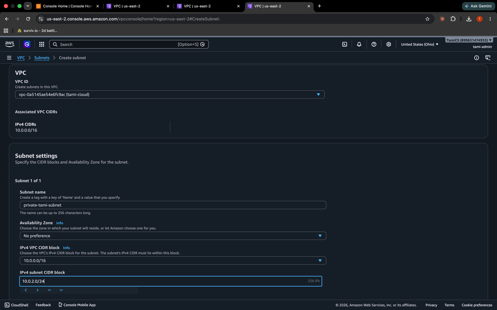
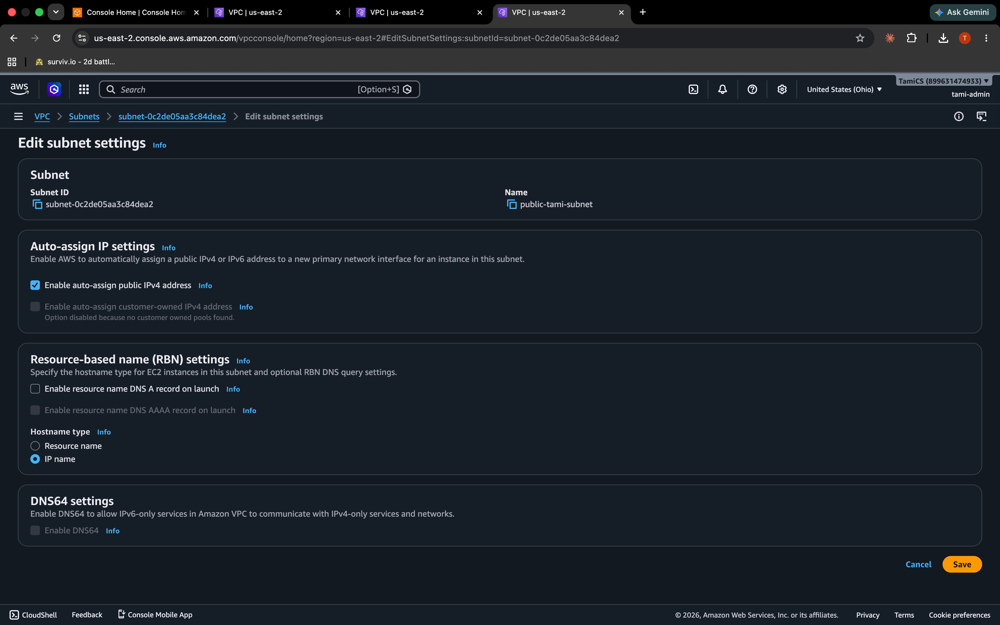

---

**Internet gateway**

Created `tami-cloud-gw` and attached it to the VPC.

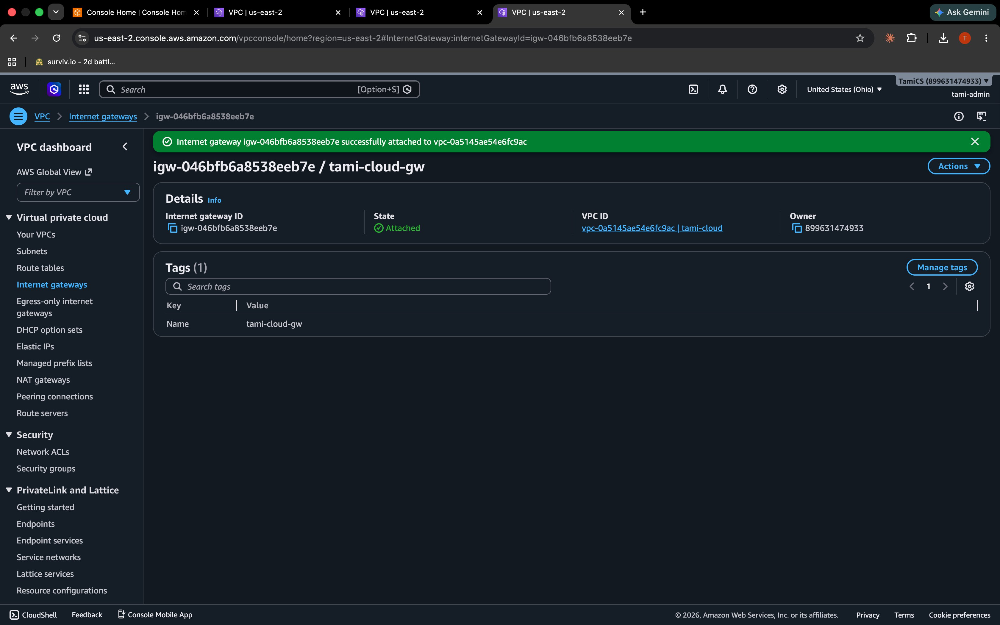

---

**Route tables**

Public route table has `0.0.0.0/0 → IGW` and `10.0.0.0/16 → local`. Private route table has only the local route, no internet access.

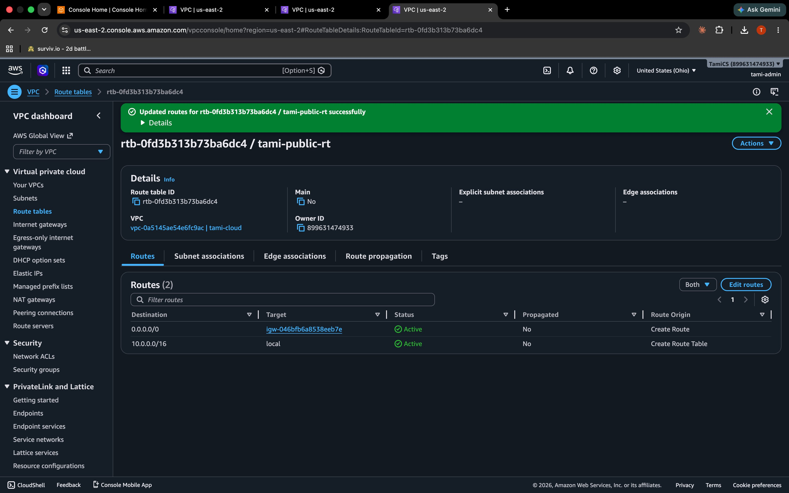
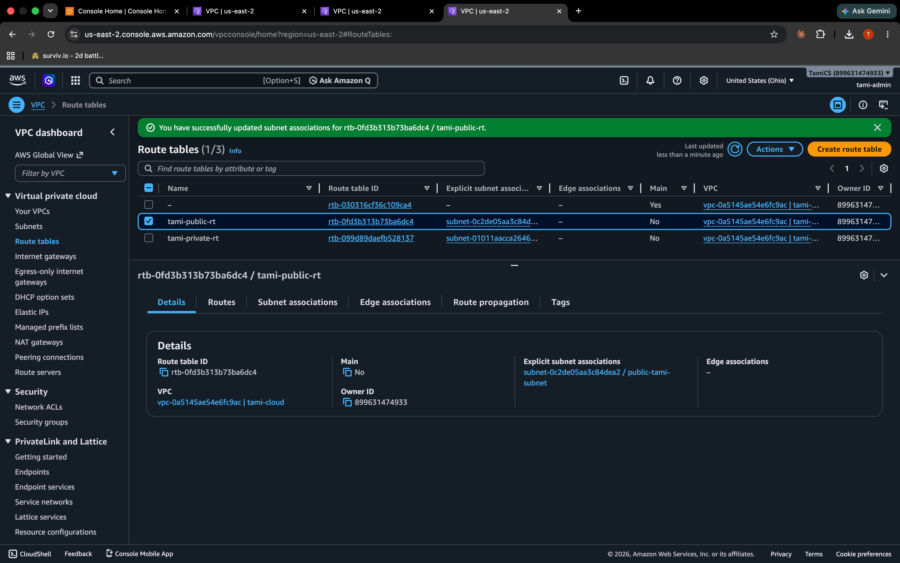
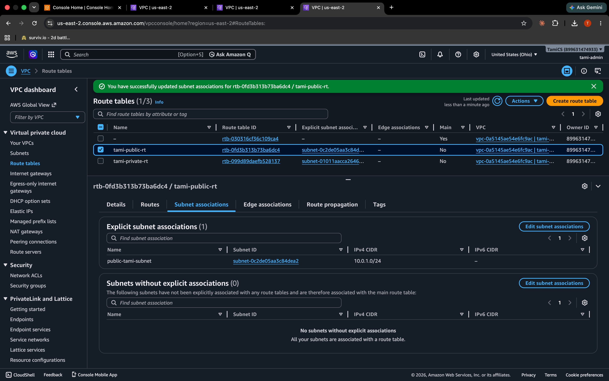
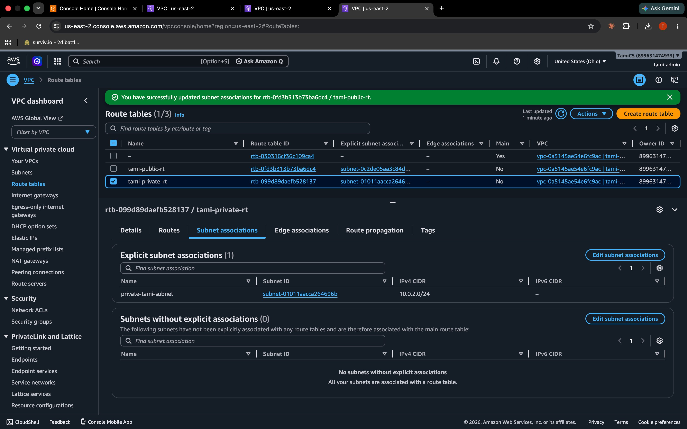

---

**Security group**

`tami-security` has zero inbound rules. Outbound allows all traffic so the SSM agent can reach AWS endpoints on port 443.

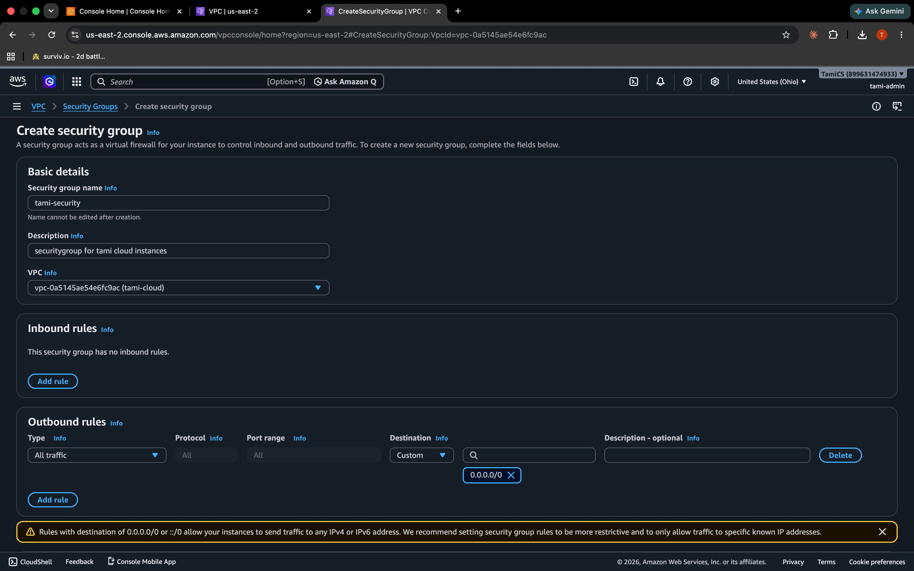

---

**EC2 and SSM access**

Launched `tami-ec2-server` (Amazon Linux 2023, t2.micro) with `ec2-ssm-role` attached. Connected via SSM Session Manager — no SSH, no key pair, no open ports.

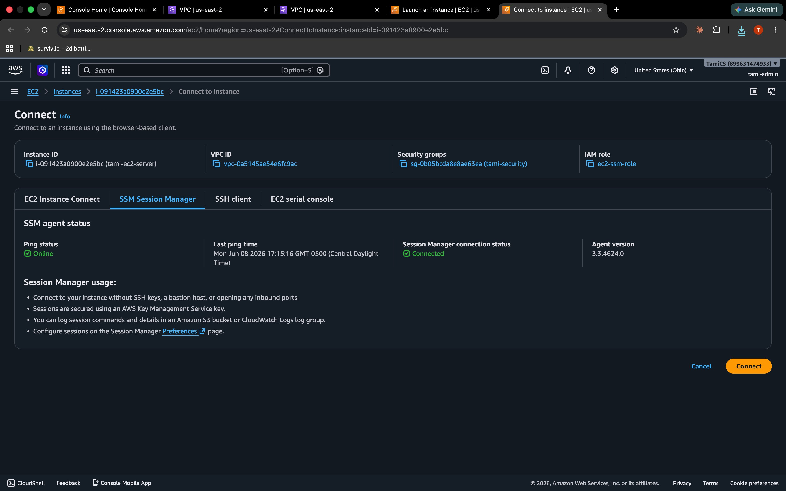

---

## Reproduce this

Full step-by-step in [docs/setup-guide.md](docs/setup-guide.md).

Prerequisites: AWS account, IAM admin user (not root), billing alert configured before deploying anything.

The EC2 instance (t2.micro, Amazon Linux 2023) is free tier eligible. Stop it when you're done.
